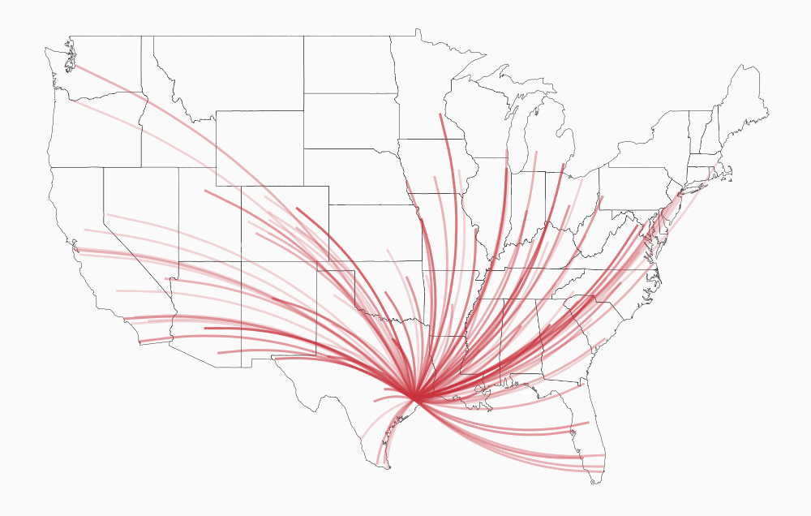

## Contents

- [Getting set up](#setup)
- [Tidy data](#tidy)
- [Background to ggplot2](#ggplot)
- [2011 Houston Flight data](#flights)
- [Data Transformation](#transform)
    + [filter()](#filter)
    + [select()](#select)
    + [arrange()](#arrange)
    + [mutate()](#mutate)
    + [summarise()](#summarise)
- [Grouped data](#group)
- [Data Pipelines](#pipe)
- [Joining Datasets](#join)
- [Whats Next?](#next)
- [Further Reading](#reading)

## Getting set up {#setup}

#### Data

This vignette contains the exempla code for the *Intermediate R: Data Manipulation and Visualisation* workshop. Specifically the hands on exercises. Data used in this workshop is included in the *IntermediateR* package avaliable at <https://github.com/G-Thomson/IntermediateR>. Once you have installed the package simply load the package to access the data.
 
```{r, message=FALSE, warning=FALSE}
library(IntermediateR)
```

#### The Tidyverse

This workshop aims to demonstrate how when data is stored in a ['tidy'](http://vita.had.co.nz/papers/tidy-data.pdf) format it is relatively easy to interrogate it. One way to achieve this is through the use of the *tidyverse* suite of tools, a group of ~20 packages which provide tools useful in all stages of data analysis. This workshop will focus on the *dplyr* and *ggplot2* packages which, along with *tidyr*, form the core of the *tidyverse*. 

The *tidyverse* package loads the most commonly used *tidyverse* packages and was installed automatically, if you didn't have it already, when you installed the *IntermediateR* package. It needs to be loaded too.

```{r, message=FALSE, warning=FALSE}
library(tidyverse)
```

## Tidy data {#tidy}

Tidy data is the consistent structuring of data such that variables are stored in columns and observations in rows coupled with a straightforward use of descriptive functions with consistent outputs. It is conceptually simple but can be tricky in practice.

For example, take the following table of global life expectancies. Is it tidy?

```{r}
life_expectancies
```

No! It is not tidy because time is a variable so should have its own column, also the numbers all measure the same thing (life expectancies). The *tidyr* package contains functions for tidying your data. I won't dwell on this too long as everyone has different data. However in this case the function **gather()** can be used to collapse columns into key-value pairs.

```{r}
life_expectancies <- gather(life_expectancies, year, lifeExp, -country, -continent)
life_expectancies 
```
This is tidy! Note how I specified the new column names (i.e. year and lifeExp) and excluded the columns I did not want gathered (i.e.  country and continent). The *tidyr* package also contains the **spread()** function which does the opposite of **gather()**, as well as the **separate()** and **unite()** functions which split or merge columns respectively.

In order to get the hang of this I recommend everytime you get a new data set practice transposing it (swap rows and columns) with **gather()** and **spread()**. 

#### How is your Data Structured?

In order to have 'tidy' data you need to know what your data looks like. I think of this as your *mental model* of the data. To do this I recomend **glimpse()**, **head()** and **View()** which are perahps the most important functions in R!

**glimpse()** (or in base R **str()**) prints a summmary of your data. This is a quick way to see the dimensions of your data, the names of the variables, their type and some example data.

```{r}
glimpse(life_expectancies)
```

**head()** prints the first n rows of data and when using RStudio **View()** brings up a spreadsheet of the data to visually inspect.

## Background to ggplot2 {#ggplot}

*ggplot2* is an implementation of the Grammar of Graphics by Leland Wilkinson and can be used to produce publication quality graphics. However its real power is to quickly visualise data in a flexible manner. All graphs follow a consistent and modular workflow with different elements being added in layers. While logical this method is not intuitive to new users coming from other platforms and so I feel some background is beneficial. The best indroduction is via example.

1. Every graph begins with the creation of a a ggplot object which requires a dataframe and aesthetics (i.e. what variables to use)
```{r eval=FALSE}
ggplot(life_expectancies, aes(year, lifeExp))
```

2. Graphical layers (or 'geoms') can then be added. For instance, if we wanted to plot the distribution of life expectancies in each year we could use boxplots like so.

  + This just involves the addition of **+ geom_boxplot()**
```{r}
ggplot(life_expectancies, aes(year, lifeExp)) +
  geom_boxplot()
```

3. ggplot2 graphs are modular so can be easily added to, altered or changed. For instance, if after creating the boxplot above you see a positive trend over time and realise that you want to capture this trend for individual countries. 

  + This can be achieved by swapping out the **geom_boxplot()** for **geom_point()** in combination with **geom_line()**. 
  + This also requires specifing how the observations in each year are related to one another. Thus you can group obsevations by a variable and specify it in the aesthetics. In this case we want to group by 'country'.


```{r}
ggplot(life_expectancies, aes(year, lifeExp, group = country)) +
  geom_point() +
  geom_line()
```

  + Great, but it is now difficult to tell what is going on. One way around this is to use colour, which is another parameter that can be defined in aesthetics. In this case lets colour by continent. Note, that you can also define colour oustside of aesthetics but this means the colour of the lines is not dependent on the data an so will all be the same colour.
  
  
```{r fig.width=4}
ggplot(life_expectancies, aes(year, lifeExp, group = country, colour = continent)) +
  geom_point() +
  geom_line()
```

4. We can now see there are clear differences between continents but comparing them is difficult on one graph. One approach is to create sub-plots or 'facets' using the **facet_grid()** call. This is a powerful function and can split the data in two directions. It is called using a formula call with rows on the left and columns on the right. I think the best representation of the graph above would be to split it into five sub-plots, one for each continent.

```{r fig.width=9}
ggplot(life_expectancies, aes(year, lifeExp, group = country, colour = continent)) +
geom_point() +
geom_line() +
facet_grid(.~continent)
```

## 2011 Houston Flight data {#flights}

This dataset contains all flights departing from Houston airports IAH (George Bush Intercontinental) and HOU (Houston Hobby) in 2011. The data comes from the [Research and Innovation Technology Administration](https://www.transtats.bts.gov/DatabaseInfo.asp?DB_ID=120&Link=0) at the Bureau of Transporation statistics and comes via a R package called *hflights*. 

I have included this dataset in *IntermediateR* and complemented it with hourly werather data for Houston in 2011 as well as metadata about the planes and other aiports in the USA.

Here is a summary:

* **hflights** - [227,496 x 21]
    * Every flight departing Houston in 2011.
* **weather** - [8,723 x 14]
    * Hourly weather data.
* **planes** - [2,853 x 9]
    * Plane metadata.
* **airports** - [3,376 x 7]
    * Airport metadata.

Familiarise yourself with this data.

## Data Transformation {#transformation}

At this point I should acknowledge that the majority of the rest of this vignette is based off Hadley Wickam's *Data Manipulation with dplyr* presentation from June 2014.

#### dplyr verbs

*dplyr* (and the tidyverse more generally) is a collection of functions named after English verbs which describe the action they perform on the data. While there are quite a few. The core ones that should be learnt first are as follows:

* **filter()** 
    * keep rows matching criteria
* **select()** 
    * pick columns by name
* **arrange()** 
    * reorder rows
* **mutate()** 
    * add new variables
* **summarise()** 
    * reduce variables to values

With *dplyr* verbs, the first argument is a data frame (or more accurately a tibble, but don't worry about that) and subsequent arguments say what to do with the data frame. Furthemore these functions always return a data frame.

### filter() {#filter}

**filter()** is a function which returns rows where specified conditions are true. Those that are NA are dropped.

Planes don't always run to time. Use **filter()** to plot a scatter plot of planes flying to San Francisco or Oakland, in January

1. *Plot a scatter plot of planes flying to San Francisco or Oakland, in January (hint: use **geom_point()**)*

```{r fig.width=4}
SF_data <- filter(hflights, Dest %in% c("SFO", "OAK"))
SF_data <- filter(SF_data, Month < 2)

ggplot(SF_data, aes(DepDelay, ArrDelay, colour = Dest)) +
  geom_point()
```

2. *and on which day of the week (Monday = 1; Sunday = 7) did the most delayed flights occur? (hint: use **facet_grid()**)*

```{r fig.width=9}
ggplot(SF_data, aes(DepDelay, ArrDelay, colour = Dest)) +
  geom_point() +
  facet_grid(.~DayOfWeek) 
```

### select() {#select}

**select()** is a very flexible function which keeps only the columns you specify, reducing the variables in your dataframe. It can also be used to reorder the columns in your dataframe.

For example, in the **weather** dataset the direction of the wind is recorded in both the cardinal directions and the more accurate compass bearing. In addition the speed is given. Use **select()** to create a dataframe of just these columns. 

1. *Select just the 'wind_dir', 'wind_dir2' and 'wind_speed' columns*

```{r}
select(weather, wind_dir, wind_dir2, wind_speed)

```

2. *and explore the flexibility in this function. Read the docs ('?select') and find three other ways to do this (hint: see 'Useful functions')*

```{r eval=FALSE}
select(weather, wind_dir:wind_speed)

select(weather, starts_with("wind"))

select(weather, contains("wind"))
```

These commands all produce the same result. While this small example is trivial hopefully you can see how this might be useful in larger datasets.

3. *What if you want to extract one column as a vector? Does selecting just one variable do this?*

```{r eval=FALSE}
select(weather, wind_speed)
```

No! This returns a data frame (with one column). If we want it as a vector we can use the verb **pull()** like so:

```{r eval=FALSE}
pull(weather, wind_speed)
```

this is equivalent to:

```{r eval=FALSE}
weather$wind_speed
```

4. *Can you plot a histogram of the wind speeds? (hint: use **geom_histogram()**; note that there are missing values in this data)*

```{r warning=FALSE}
wind <- select(weather, starts_with("wind"))

ggplot(wind, aes(wind_speed)) +
  geom_histogram(binwidth = 2)
```

*What does **geom_density()** do?*

```{r warning=FALSE}
ggplot(wind, aes(wind_speed)) +
  geom_density()
```

This creates a kernel density estimate, which is a smoothed version of the histogram. This is useful for overlaying distributions of data.


### arrange() {#arrange}

**arrange()** is a function used to sort a dataframe. You can specify the variable(s) you wish to sort by.

1. *Looking at the 'planes' dataset, how old is the oldest aircraft flying out of Houston?*


```{r}
arrange(planes, year)
```

2. *Looking at the 'weather' dataset, what was the warmest recorded temperature in Houston?*

```{r}
arrange(weather, desc(temp))
```

### mutate() {#mutate}


**mutate()** is a function which can be used to adds new variable to a dataframe. These can be functions of existing variables. It is also useful to edit existing columns.

We previously saw that the warmest temperature on record was 108.0°F. I am more familiar with celcius, can we convert it to that? 

1. *Create a new column coverting fahrenheit to celcius (hint: °C = (°F-32)/1.8 )*

```{r}
weather <- mutate(weather, temp_cel = (temp-32)/1.8) 
```

Look at this column, it has 6 decimal places, I think two is enough.

2. *Edit this column so that it only has two decmal places*
```{r}
weather <- mutate(weather, temp_cel = round(temp_cel, digits = 2)) 
```

Houston in summer is hot! It would be nice to see this visualised in a way such that the variation is not lost. We could use this data to make a heatmap of the temperatures (in celcius of course) throughout the month of July.

3. *Create a heatmap (hint: **geom_tile()**) of the temperature for each day in the month of July (hour vs day). To do this you will need to **filter()** first.*

```{r}
weather_july <- filter(weather, month == 7)

ggplot(weather_july, aes(hour, day, fill = temp_cel)) + 
  geom_tile() +
  scale_fill_gradientn(colours = c("#ECD078", "#C02942"), na.value="grey90")
```

### summarise() {#summarise}

**summarise()** is a function which reduces multiple values down to a single value. It is mostly used with grouped data (see next section). 

## Grouped Data {#group}

Data can be subsetted into **groups** which allows to perform operations on subsets or combinations of variables

Let us return to the question of how much flights are delayed? Since this is a large dataset it would be nice to condense it so that it is easier to interpret.

1. *Group by Month and calculate the mean departure delay, in addition calculate the standard deviation and number of delayed flights (hint: mean(), sd(), and n() are useful functions)*

Note: you will likely have to account for data which is missing (here it is "NA")

```{r}
delayed_flights <- filter(hflights, !is.na(DepDelay))
delayed_flights <- group_by(delayed_flights, Month) 
delayed_flights <- summarise(delayed_flights, delay_mean = mean(DepDelay), 
                             delay_sd = sd(DepDelay), 
                             n = n()) 
delayed_flights
```

2. *Can you then calculate the standard error and then a 95% margin of error (half a confidence interval)?*

Note: Standard error (se) is $\frac{sd}{\sqrt{n}}$ and margin of error (moe) is $t-statistic \times se$

The relevant t-statistic can be obtained from `qt(1 - (0.05 / 2), n - 1)`

```{r}
delayed_flights <- mutate(delayed_flights, delay_se = delay_sd / sqrt(n),
                          moe = qt(1 - (0.05 / 2), n - 1) * delay_se)
delayed_flights
```


## Data Pipelines {#pipe}

In reality, data analysis requires the use of multiple functions.

Commands can be done one at a time or combined. For example, if we combine the analysis from the previous section we get:

```{r eval=FALSE}
mutate(
  summarise(
    group_by(
      filter(
        hflights, !is.na(DepDelay)), 
      Month), 
    delay_mean = mean(DepDelay), 
    delay_sd = sd(DepDelay), 
    n = n()), 
  delay_se = delay_sd / sqrt(n), 
  moe = qt(1 - (0.05 / 2), n - 1) * delay_se)
```

However this is messy and difficult to read as the variables get separated from the function calls. Understanding and editing is thus comprimised.

One solution is to write out each function on it's own line assigning it to a variable, but this is verbose and clunky. An alternative is the pipe operator from the *magrittr* which looks like this %>% (there are others but lets stick to one for now). The way it works is that it links two functions such that the output of the function on the left becomes the first variable of the function on the right. Therefore instead of writing $f(x, y)$ one can write $x$ %>% $f(y)$.

This means the output of one function can become the input of a second and thus chain together multiple
functions. This results in more concise, readable code. When reading the convention is to pronounce %>% as 'then'.

1. *Rewrite the summary of the delayed flights (mean, standard deviation, etc.) from the previous section using pipes*

```{r eval=FALSE}
delayed_flights <- hflights %>%
  filter(!is.na(DepDelay)) %>%
  group_by(Month) %>%
  summarise(delay_mean = mean(DepDelay), 
            delay_sd = sd(DepDelay),
            n = n())  %>% 
  mutate(delay_se = delay_sd / sqrt(n),
         moe = qt(1 - (0.05 / 2), n - 1) * delay_se)
```


2. *Can you pipe it into a barchart? (hint: **geom_bar(stat=”identity”)** and **geom_errorbar(aes(ymin, ymax)))** *

```{r}
  ggplot(delayed_flights, aes(Month, delay_mean)) +
    geom_bar(stat="identity") +
    geom_errorbar(aes(ymin = delay_mean - moe, ymax = delay_mean + moe)) 
```

Note how here we have to use **stat="identity"** when calling **geom_bar()**. This hints at some of the underlying complexity in ggplot2. Briefly, most geoms also have some sort of transformation (or 'stat') associated with them to allow visualisation. **geom_bar()** actually has several but **stat="identity"** forces it to use the value you provide and not try to generate the total/average itself. While the use of **stat="identity"** is not the default I nevertheless find it is the most common.

3. *Experiment with the groupings, instead of Month try DayOfWeek; try both simultaneously*

- Group by DayOfWeek

```{r}
hflights %>%
  filter(!is.na(DepDelay)) %>%
  group_by(DayOfWeek) %>%
  summarise(delay_mean = mean(DepDelay), 
            delay_sd = sd(DepDelay),
            n = n())  %>% 
  mutate(delay_se = delay_sd / sqrt(n),
         moe = qt(1 - (0.05 / 2), n - 1) * delay_se) %>% 
  
  ggplot(aes(DayOfWeek, delay_mean)) +
  geom_bar(stat="identity") +
  geom_errorbar(aes(ymin = delay_mean - moe, ymax = delay_mean + moe)) 
```

- Group by Month and DayOfWeek

```{r fig.width=9}
hflights %>%
  filter(!is.na(DepDelay)) %>%
  group_by(Month, DayOfWeek) %>%
  summarise(delay_mean = mean(DepDelay), 
            delay_sd = sd(DepDelay),
            n = n())  %>% 
  mutate(delay_se = delay_sd / sqrt(n),
         moe = qt(1 - (0.05 / 2), n - 1) * delay_se) %>% 
  
  ggplot(aes(DayOfWeek, delay_mean)) +
  geom_bar(stat="identity") +
  geom_errorbar(aes(ymin = delay_mean - moe, ymax = delay_mean + moe)) +
  facet_grid(.~Month)
```

I hope you can see how minor tweaks to the code allow the rapid exploration of the data.

## Joining Datasets {#join}

More complex analyses require data from multiple datasets (e.g. a lookup table). In this case I would like to create a image such as this: 

{ width=50% }

1. *How can we make a plot like this? What data is required?*

The data required is the geospatial data depicting the United States, the unique flights from Houston and the locations of these destinations.

Fortunately *ggplot2* has several simple geospatial data sets including the United States which we can use. We can obtain a list of the unique flights from the **hflights** dataset and the locations of the airport destinations from the **airports** dataset.

```{r message=FALSE}
# Geospatial data
usa <- map_data("state")

# Unique flights from Houston
rel_flights <- hflights %>% 
  distinct(Origin, Dest) %>% 
  mutate(origin_lat = 29.65, origin_long = -95.28) %>% 
  select(Origin, origin_lat, origin_long, Dest)

# Location of the airport destinations 
rel_airports <- airports %>% 
  filter(iata %in% c("IAH", "HOU", rel_flights$Dest)) %>% 
  select(iata, lat, long) %>% 
  rename(Dest = iata) 

 
```

These datasets then need to be combined this can be achieved using a *left_join()*. Note I also omit flights to destinations outside the United States or Airports which are either private or have closed since 2011.

```{r}
rel_flights_airports <- rel_flights %>% 
  left_join(rel_airports, by = "Dest") %>% 
  rename(dest_lat = lat, dest_long = long)

US_conn <- rel_flights_airports %>% 
  filter(!Dest%in% c("SJU", "ANC", "HNL", "ECP", "BKG"))
```

I can then use the geospatial data to draw a map and the combined flight and destination data to draw the flights.

```{r fig.width=5}
ggplot(usa, aes(x=long, y=lat)) + 
  geom_map(map=usa, aes(map_id=region),  fill="#ffffff", color="black", size=0.15) +
  geom_curve(data = US_conn, aes(x = origin_long, y = origin_lat, xend = dest_long, yend = dest_lat), col = "#CC333F", alpha = 0.2, size = 1, curvature = .2) +
  theme(panel.background = element_rect(fill="white"), 
        axis.line = element_blank(),
        axis.text.x = element_blank(),
        axis.text.y = element_blank(),
        axis.ticks = element_blank(),
        axis.title.x = element_blank(),
        axis.title.y = element_blank()
  )
```


## Whats Next? {#next}

It is important to practice using these tools with your own data. Even if you find it slow and difficult at first. Also, ask for help when you get stuck.

## Further Reading {#reading}

- [*R for Data Science* by G. Grolemund and  H. Wickham](http://r4ds.had.co.nz/)
- [Rstudio Cheatsheets](https://www.rstudio.com/resources/cheatsheets/)
- [R graph catalog](http://shiny.stat.ubc.ca/r-graph-catalog/), [ggextensions](http://www.ggplot2-exts.org/gallery/),  [ggedit](http://r-posts.com/ggedit-0-2-0-is-now-on-cran/) and [ggplot2 significance levels](http://www.sthda.com/english/wiki/add-p-values-and-significance-levels-to-ggplots)
- [STAT 545](http://stat545.com/index.html) - Jenny Bryan's postgraduate R course  at UBC
- Apply functions to [a selection of variables](http://dplyr.tidyverse.org/reference/scoped.html)
- Vignette on [Window functions](https://cran.r-project.org/web/packages/dplyr/vignettes/window-functions.html)
- Look into [*lubridate*](http://lubridate.tidyverse.org/) for dates and [*stringr*](http://stringr.tidyverse.org/) for strings (see  [this tutorial](https://rstudio-pubs-static.s3.amazonaws.com/180610_d3764c43f1e54692b7e84d21ec94772a.html?utm_content=buffer13f71&utm_medium=social&utm_source=twitter.com&utm_campaign=buffer#1)) and [*forcats*](http://forcats.tidyverse.org/) for catagorical variables.

